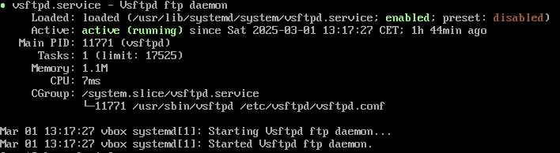
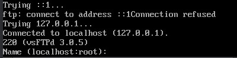

# Partie 5 : Mise en place d'un serveur FTP + TLS

## Installation et vérification du service

Installation du serveur **vsftpd** :
```bash
sudo dnf update && sudo dnf install vsftpd -y
```

Vérification du statut du service :
```bash
sudo systemctl status vsftpd
```


## Configuration de vsftpd

Modification du fichier de configuration :
```bash
sudo nano /etc/vsftpd.conf
```

### Contenu du fichier `/etc/vsftpd.conf` :

```ini
# Activer le mode standalone
listen=YES
listen_ipv6=NO

# Sécuriser les connexions avec TLS
ssl_enable=YES
rsa_cert_file=/etc/ssl/private/vsftpd.pem
rsa_private_key_file=/etc/ssl/private/vsftpd.pem
force_local_logins_ssl=YES
force_local_data_ssl=YES
ssl_tlsv1=NO
ssl_sslv2=NO
ssl_sslv3=NO
require_ssl_reuse=NO

# Mode utilisateur restreint
chroot_local_user=YES
allow_writeable_chroot=YES

# Activer les utilisateurs locaux
local_enable=YES
write_enable=YES

# Masquer les fichiers des autres utilisateurs
user_sub_token=$USER
local_root=/home/$USER/ftp

# Timeout pour sécurité
idle_session_timeout=600
data_connection_timeout=120

# Permissions sécurisées
file_open_mode=0777
local_umask=022

# Liste d’utilisateurs autorisés
userlist_enable=YES
userlist_file=/etc/vsftpd/user_list
userlist_deny=NO
```

## Génération et sécurisation du certificat

Création d'un certificat auto-signé :
```bash
sudo openssl req -x509 -nodes -days 365 -newkey rsa:2048 \
    -keyout /etc/ssl/private/vsftpd.pem \
    -out /etc/ssl/private/vsftpd.pem
```

Application des permissions les plus restrictives :
```bash
sudo chmod 600 /etc/ssl/private/vsftpd.pem
```

Vérification des permissions :
```bash
ls -l /etc/ssl/private/vsftpd.pem
---> -rw------- 1 root root 5305 Mar    1 12:13 /etc/ssl/private/vsftpd.pem
```

## Configuration du pare-feu

Ouverture du port FTP sécurisé :
```bash
sudo firewall-cmd --add-service=ftp --permanent
sudo firewall-cmd --reload
```

Vérification des ports ouverts :
```bash
sudo firewall-cmd --list-ports
---> 21/tcp 990/tcp 2222/tcp
```

## Test de connexion FTP

Connexion au serveur FTP en local :
```bash
ftp localhost
```

